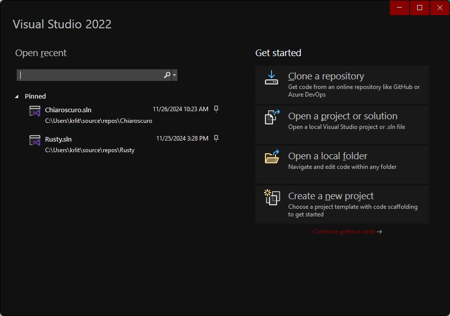
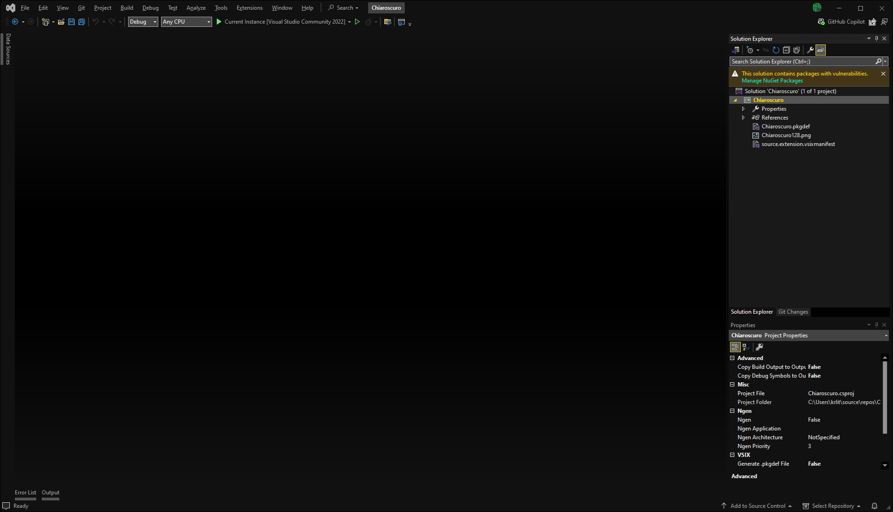
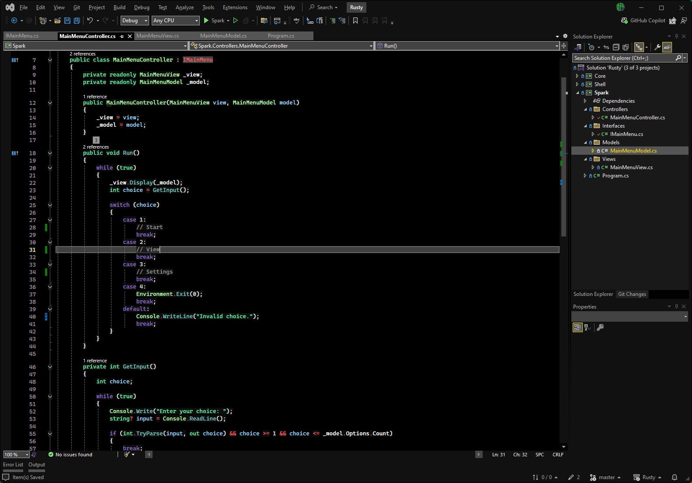
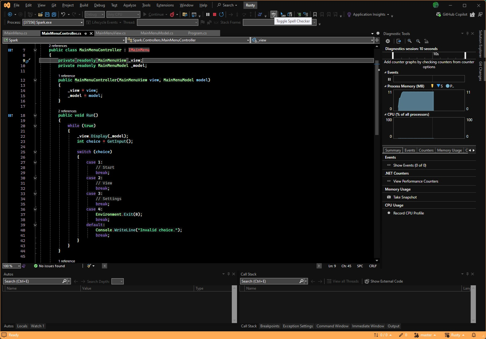

# ⚫ *Chiaroscuro* ⚪

## A Modern Thematic Suite

**Chiaroscuro** - *the interplay of light and shadow to emphasize volume and emotion*

---

### Why Choose *Chiaroscuro*?

#### Efficient and Elegant

- There's **undeniable beauty in simplicity** - let ***Chiaroscuro*** help you **focus on what matters most**
  - With its **modest visuals, *Chiaroscuro*** maximizes **comfort** and **efficiency,** helping you to stay **focused** and **energized** for those longer coding sessions

#### Modest Design, Maximum Clarity

- **No chaos, just clarity** - The editor window is designed to be **clean and intuitive,** allowing you to concentrate on your code
  - **Reduced visual clutter** while maintaining valuable information, striking a balance between **clarity** and **simplicity**

---





---

### Features

#### Current

- A basic WIP **Dark Mode theme** to build upon

#### Planned

- **Updates** to the *Main Theme*

#### Backlog

- **More** themes!
  - **Light** Mode
  - **High Contrast** Modes
  - **Accessibility** for Vision-Impaired

---

##### Installation

> 1. Download the project from GitHub
> 2. Build the solution in VS2022
> 3. Open the VSIX file with Microsoft Visual Studio Version Selector (Right click > Open With)
> 4. Activate the theme within Visual Studio (Tools > Theme > {Theme Name})

##### Forced Update

> 1. Uninstall the extension via the Visual Studio Extension Manager (Extensions > Manage Extensions)
> 2. Restart Visual Studio and then close it again
> 3. Install updated VSIX via instructions above
> 4. Activate theme via instructions above

##### Default Location

```
Root:\Users\{username}\AppData\Local\Microsoft\VisualStudio\{version}\Extensions\{Chiaroscuro}
```

---





---

##### Community & Contributions

Have feedback or suggestions for *Chiaroscuro*? I would love to hear it.
Please, join the conversation or submit a pull request here on GitHub.

---

###### ⚪ *Embrace the Dark Mode* ⚫

---